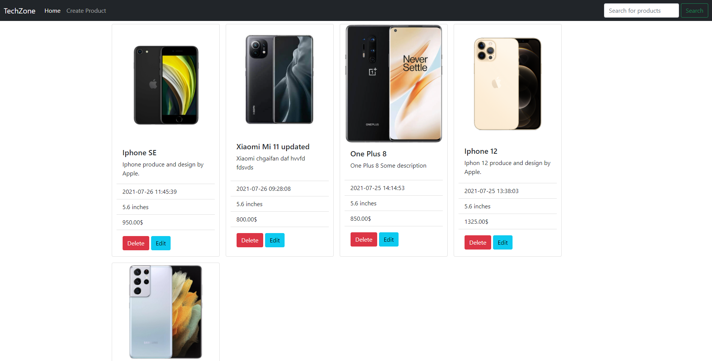
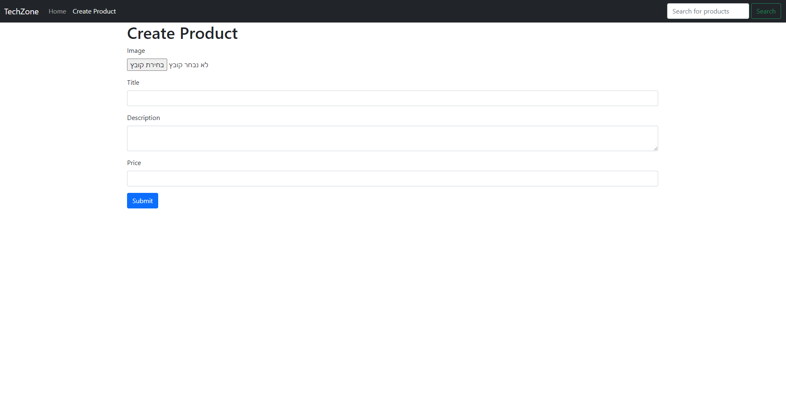
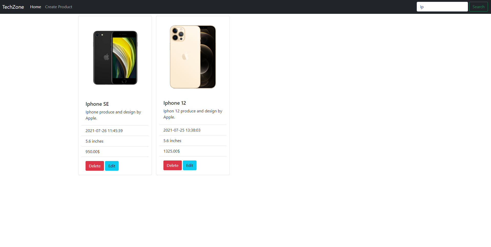
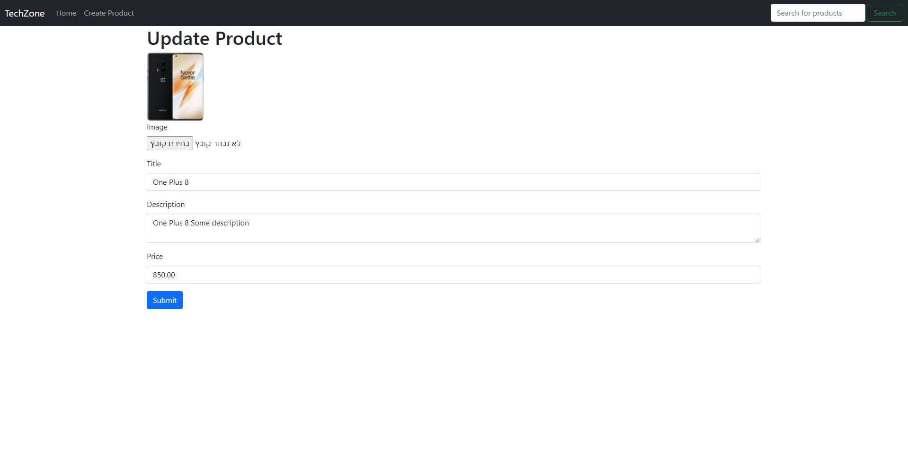

## TechZone V1

> simple E-commerce platform built with php and mysql without framework.
> based OOP and MVC architectural pattern.






## Technologies & Tools

### Front-end:

- html
- bootstrap

### Backend:

- php
- mySql
- composer (for manage dependencys)

## Features

- create product
- view all products
- update product
- search for products
- delete product

## Usage

### Database

- create mysql table with 6 columns (id = auto increment(INT), title(VARCHAR), description(LONGTEXT), image(VARCHAR), price(DECIMAL), create_date(DATETIME))
- name the table 'products_crud_php' or change the dsn in the Database file.

### Install Dependencies (frontend & backend)

```
composer install
```

### Run

```
cd ./public
# Run on port :8080
php -S localhost:8080
```
